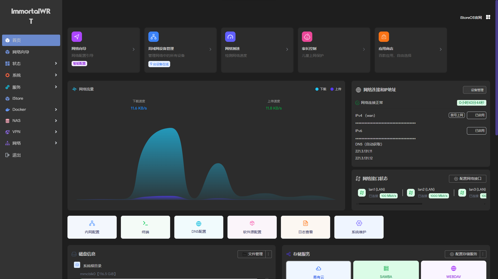

---

## 1. 项目信息

- **原脚本仓库**：[https://github.com/ZqinKing/wrt_release.git](https://github.com/ZqinKing/wrt_release.git)
- **源码来源**：[https://github.com/VIKINGYFY/immortalwrt.git](https://github.com/VIKINGYFY/immortalwrt.git) - main
- **设备支持**：Link_NN6000V2

---

## 2. 固件配置

### 2.1 系统配置

| 配置项 | 默认值 | 说明 |
|--------|--------|------|
| **LAN IP** | `10.0.0.1` | (wrt_core/patches/991_set_lanip.sh) |
| **WiFi 名称** | `500/5` | (wrt_core/patches/992_set-wifi-uci.sh) |
| **WiFi 密码** | `147258369` | 无线密码 |
| **WiFi 状态** | **禁用** | 首次启动需手动开启 |
| **PPPoE 账号** | **未配置** | (wrt_core/patches/993_set_pppoe.sh) |
| **PPPoE 状态** | **自动拨号** | 首次启动自动配置 |

---

### 2.2 预装插件（22 个）

| 插件名称 | 功能说明 |
|---------|---------|
| **luci-app-argon** | Argon 主题 |
| **luci-app-istorex** | 应用商店 |
| **luci-app-dockerman** | Docker |
| **luci-app-adguardhome** | 广告过滤 |
| **luci-app-diskman** | 磁盘管理 |
| **luci-app-smartdns** | DNS 加速 |
| **luci-app-autoreboot** | 定时重启 |
| **luci-app-sqm** | QoS 智能队列 |
| **luci-app-upnp** | UPnP 端口映射 |
| **luci-app-hd-idle** | 硬盘休眠 |
| **luci-app-p910nd** | USB 打印机共享 |
| **luci-app-easytier** | EasyTier 虚拟组网 |
| **luci-app-zerotier** | ZeroTier 虚拟组网 |
| **luci-app-lucky** | 大鸡 |
| **luci-app-oaf** | 应用行为过滤 |
| **luci-app-ttyd** | 终端 |
| **luci-app-quickfile** | 文件管理 |
| **luci-app-samba4** | SMB 文件共享 |
| **luci-app-pbr** | 策略路由 |
| **luci-app-wol** | 网络唤醒 |
| **luci-app-passwall** | 科学上网 |

---

## 3. 插件来源

三方插件源自：[https://github.com/kenzok8/jell](https://github.com/kenzok8/jell)

---

## 4. 项目结构

```
wrt_release/
├── wrt_core/              # 核心模块目录
│   ├── compilecfg/        # 编译配置文件 (.ini)
│   ├── deconfig/          # 默认配置文件 (.config)
│   ├── modules/           # 模块化脚本
│   │   ├── general.sh
│   │   ├── feeds.sh
│   │   ├── packages.sh
│   │   └── system.sh
│   ├── patches/           # 系统和软件包补丁
│   │   ├── 991_set_lanip.sh
│   │   ├── 992_set-wifi-uci.sh
│   │   └── 993_set_pppoe.sh
│   ├── scripts/           # 辅助脚本
│   ├── update.sh          # 更新逻辑主入口
│   └── pre_clone_action.sh # 预克隆操作
├── build.sh               # 主编译脚本
└── firmware/              # 固件输出目录
```

---

## 5. OAF 应用过滤使用说明

使用 OAF（应用过滤）功能前，需先完成以下操作：

**步骤 1** → 打开 **系统设置** → **启动项** → 定位到「**appfilter**」

**步骤 2** → 将「**appfilter**」从 **已禁用** 更改为 **已启用**

**步骤 3** → 点击 **启动** 按钮激活服务

⚠️ **注意**：未启用启动项将导致 OAF 功能无法正常工作

---

## ImmortalWrt

<div align="center">



</div>

---

